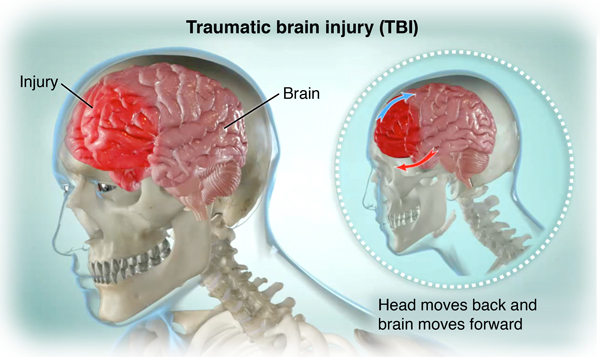
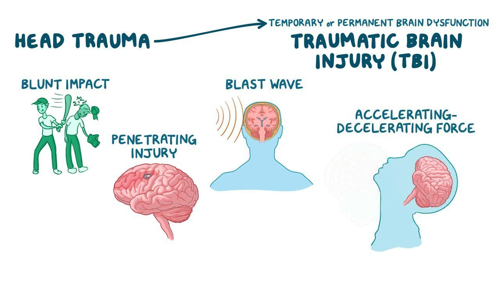

```{r setup, include=FALSE}
library(flexdashboard)
```

Overview 
===

column {data-width=500}
-----------------------------------------------------------------------


### **What is TBI?**

Traumatic brain injury, often known as a TBI is an injury that affect the way the brain functions. It can be caused by a bump, blow, jolt to the head or related injury. Depending on the severity of the injury TBI patients may experience health problems that last a few days or for the rest of their life.

Some of the symptoms of TBI:

* Headaches

* Dizziness

* Confusion

* Slurred speech

* Poor concentration

* Memory problems

* Personality changes


**References:**

[About TBI](https://www.cdc.gov/traumaticbraininjury/get_the_facts.html)

[Symptoms](https://www.hopkinsmedicine.org/health/treatment-tests-and-therapies/rehabilitation-after-traumatic-brain-injury)

[Image Source: TBI](https://www.hopkinsmedicine.org/health/treatment-tests-and-therapies/rehabilitation-after-traumatic-brain-injury)

[Image Source: Causes](https://www.osmosis.org/learn/Traumatic_brain_injury:_Clinical_practice)

column {data-width=500}
------------------------------------------------------------------------

### TBI

```{r picture, echo=FALSE, out.width='100%'}


```

### Causes

```{r}

```


Injury Mechanism
====

```{r, echo=FALSE}
library(tidytuesdayR)
library(tidyverse)
library(magrittr)
library(skimr)
library(plotly)
```

```{r, echo=FALSE, message=FALSE, warning=FALSE, results='hide'}
tt_data <- tt_load("2020-03-24")
readme(tt_data)


```

```{r, echo=FALSE}
tbi_age  <- tt_data$tbi_age

data <- tbi_age %>% select(-rate_est) %>%
  pivot_wider(names_from = "age_group", values_from = "number_est")

age_data <- data %>% select(-c(`0-17`, Total))

age_data <- age_data %>% 
  pivot_longer(3:11, names_to = "age_group", values_to = "number_est") %>%
  na.omit()

```


### Number of TBI cases by injury mechanism and age group in 2014

```{r, fig.width=12}
machanism <- age_data %>% filter(injury_mechanism %in% c("Assault", "Intentional self-harm", "Motor Vehicle Crashes", "Unintentional Falls", "Unintentionally struck by or against an object"))

 ggplot(machanism, aes(x = age_group, y = number_est, fill = injury_mechanism)) +
  geom_bar(stat = "identity", position = "dodge", show.legend = FALSE) +
  labs(x = "Age group", y = "Estimated observed cases") +
  theme_bw() + facet_wrap( ~injury_mechanism, scales = "free_y")  

```


Type of measure
===

column {data-width=450}
------------------------------------------------------------------------

### Total number of TBI hospitalizations by age group in 2014

```{r}
hospitalizations <- age_data %>% filter(type == "Hospitalizations")

ggplot(hospitalizations, aes(x = age_group, y = number_est)) + 
    geom_bar(fill = "forestgreen", color = "forestgreen", stat = "identity") + 
    labs(x = "Age group", y = "Total number of hospitalizations") +
  theme_bw()

```

column {.tabset}
------------------------------------------------------------------------

### Total number of TBI emergency department visits by age group in 2014

```{r}
ED_visits <- age_data %>% filter(type == "Emergency Department Visit")

ggplot(ED_visits, aes(x = age_group, y = number_est)) + 
  geom_bar(fill = "#509FC0", color = "#509FC0", stat = "identity") + 
  labs(x = "Age group", y = "Total number of Emergency Department Visits") +
  scale_y_continuous(labels = function(y) paste0(y/10^5, "00000")) +
  theme_bw()

```

### Total number of TBI deaths by age group in 2014

```{r}
deaths <- age_data %>% filter(type == "Deaths")

ggplot(deaths, aes(x = age_group, y = number_est)) + 
  geom_bar(fill = "#AA92CE", color = "#AA92CE", stat = "identity") + 
  labs(x = "Age group", y = "Total number of deaths") +
  theme_bw()

```


Comparison of cases between Years 2006-2014
===

```{r}
tbi_year  <- tt_data$tbi_year
year_data <- tbi_year %>% na.omit() %>% group_by(type, year) %>%
  mutate(total = sum(number_est))  

```

column {.tabset}
------------------------------------------------------------------------

### Total Number of TBI cases repoted by year 2006-2014

```{r}
plot1 <- ggplot(year_data, 
        aes(x = year, y = total, color = type)) +                                          geom_point() + 
        scale_y_continuous(labels = function(y) paste0(y/1000000, " million")) + 
        geom_line() + labs(x = "Year", y = "Total estimated observed cases",
                           title = "Total Number of TBI cases repoted by year 2006-2014") +
        theme_bw()

ggplotly(plot1)

```

### Estimated number of TBI emergency department visits by injury mechanism and year

```{r}
ed <- year_data %>% filter(type == "Emergency Department Visit")
plot2 <- ggplot(ed, aes(x = year, y = number_est, color = injury_mechanism)) + 
         geom_point() +
         geom_line() + labs(x = "Year", y = "Estimated observed cases",
                            title = "Estimated number of TBI emergency department visits by injury mechanism and year") +
         theme_bw() 

ggplotly(plot2)

```


### Estimated number of TBI hospitalizations by injury mechanism and year

```{r}
hospital <- year_data %>% filter(type == "Hospitalizations")
plot3 <- ggplot(hospital, aes(x = year, y = number_est, color =                injury_mechanism)) + 
         geom_point() +
         geom_line() + labs(x = "Year", y = "Estimated observed cases",
                            title = "Estimated number of TBI hospitalizations by injury mechanism and year") +
         theme_bw() 

ggplotly(plot3)

```

### Estimated number of TBI deaths by injury mechanism and year

```{r}
deaths <- year_data %>% filter(type == "Deaths")
plot4 <- ggplot(deaths, aes(x = year, y = number_est, color =                injury_mechanism)) + 
         geom_point() +
         geom_line() + labs(x = "Year", y = "Estimated observed cases",
                            title = "Estimated number of TBI deaths by injury mechanism and year" ) +
         theme_bw() 

ggplotly(plot4)

```